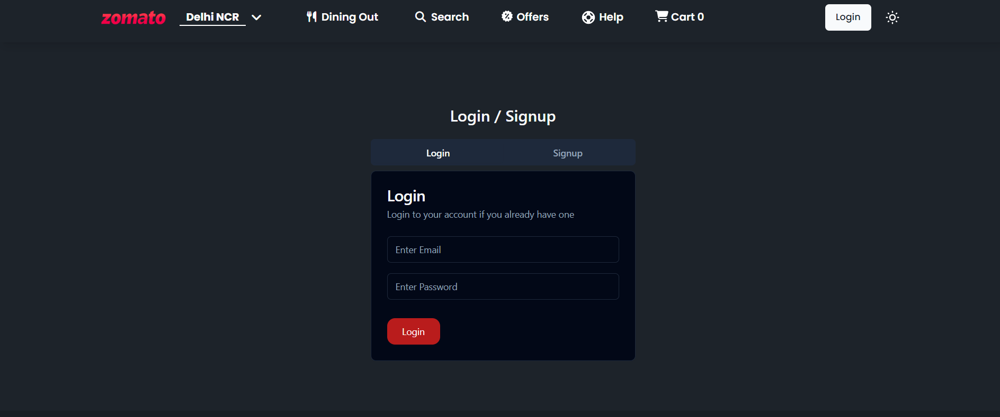
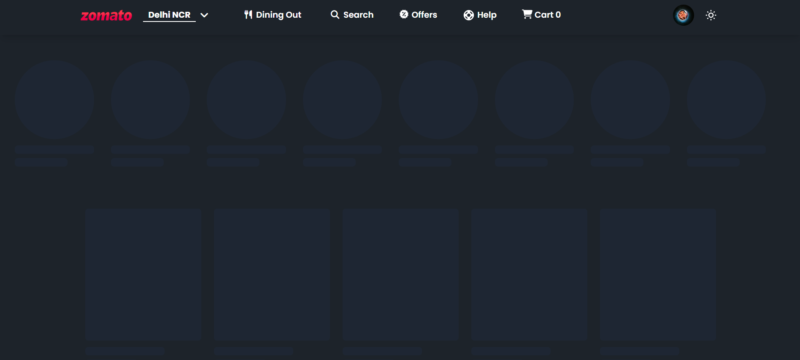
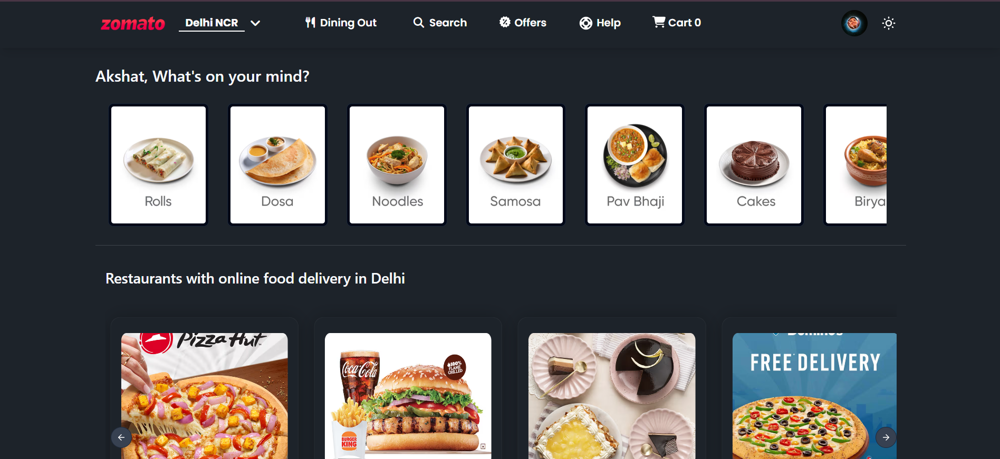
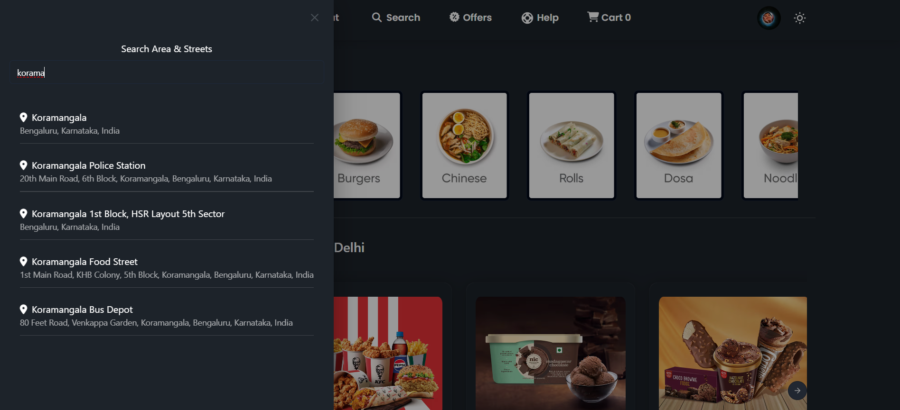
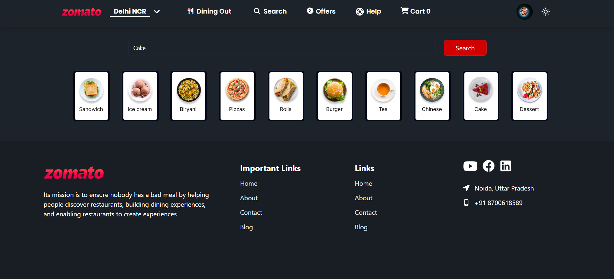
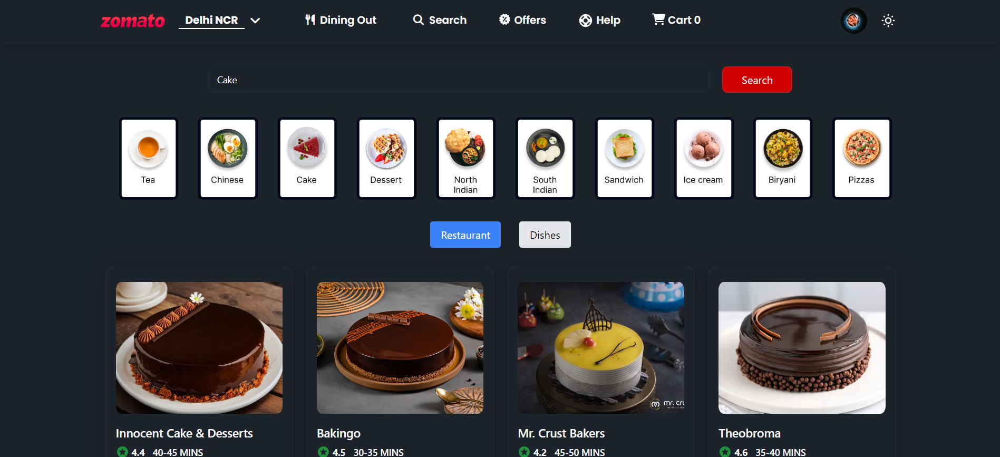
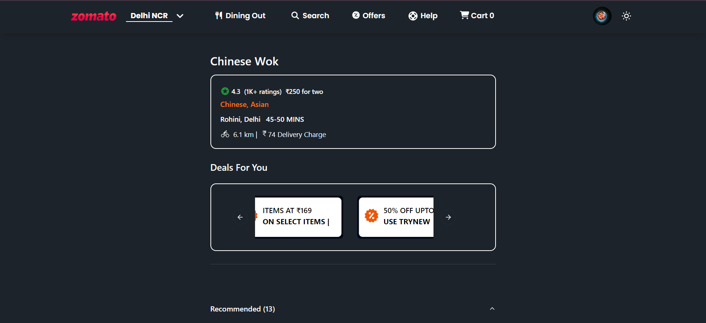
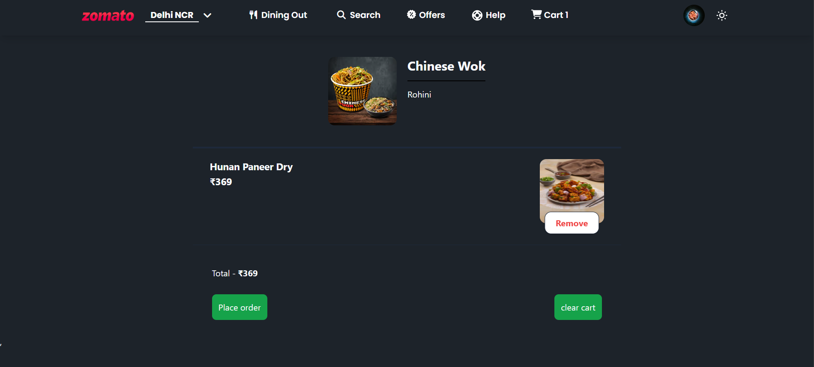
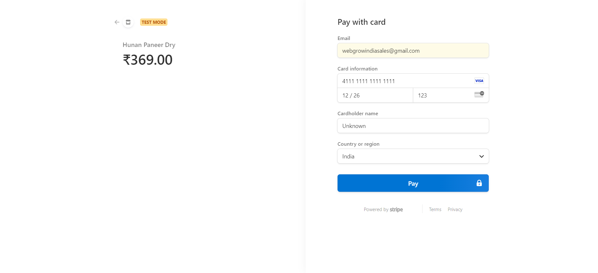

<h1> Food Ordering App</h1>

 Food Ordering App like Zomato and Swiggy

           

This App Divided into two parts
 

1. Client Folder : Frontend Based on React,Redux Toolkit(RTK) and Other React UI Libararies.
    

2. Server Folder : Backend Based on Node and Stripe payment Gateway Running on The Server.
    

Locally Hosted Link : https://main--swiggybyrk.netlify.app
 

<h2>Setup</h2>

Client Folder : Front-end

<li>Install the Node Module Folder : npm install</li>
<li>Run Command : npm run dev</li>
           

Create .env file and put configure</li>
<li>VITE_SUPABASE_URL=YOUR_BASE_URL_WILL_HERE</li>
<li>VITE_SUPABASE_KEY=YOUR_API_KEY_WILL_HERE</li>
           

Server Folder : Back-end

<li>Install the Node Module Folder : npm install</li>
<li>Server Start : npm start</li>
           

Create .env file and put configure</li>
<li>STRIPE_SECRET=YOUR_API_KEY_WILL_HERE</li>
           
<h2>Features</h2>

- Home Page (is user !authorised)
    - Signin/Signup Page
        -SignInForm / SignUpForm
- Browse Page
    - Navbar
    - What's On Your Mind
    - Top Restaurants Chains
    - Restaurants Info
    - Reastaurant Menu
    - Search (Restaurants & Dishes)
    - Cart Page
    - Orders Page
    - Search Nearby Restaurants using Location
    - Checkout (payment Gateway Integration)
- Functionality
    - Theme Swithcer
    - Add to Cart
    - Search
    - Browse Menu
- BackEnd
    - Stripe
           

<li>Authorisation Page</li>

           
<li>Shimmer Ui Effect</li>

           
<li>Home Page</li>

           
<li>Search Location</li>

           
<li>Search Functionality</li>

           
<li>Search Restaurant</li>

           
<li>Menu Page</li>

           
<li>Add To Cart</li>

           
<li>Checkout Page</li>

           
<h1>💖 Support This Project</h1>

Thank you for taking the time to explore Food Ordering App.This project represents an in-depth implementation of features extracted from the inspiring course "Namaste-React" by Akshay Saini. It's been a rewarding journey, and I'm genuinely grateful for the opportunity to create and share this with the community.

I want to express my heartfelt thanks to everyone who has shown interest and provided feedback. Your support and involvement mean a lot to me.

If you have any questions, suggestions, or just want to connect, feel free to reach out.

           
<Happy coding />
           
<h1>🙏 Thank You 🙏</h1>

Feel free to modify it to suit the tone and style of your project. The goal is to encourage participation, collaboration and learning.

Made with ❤️ and React.

